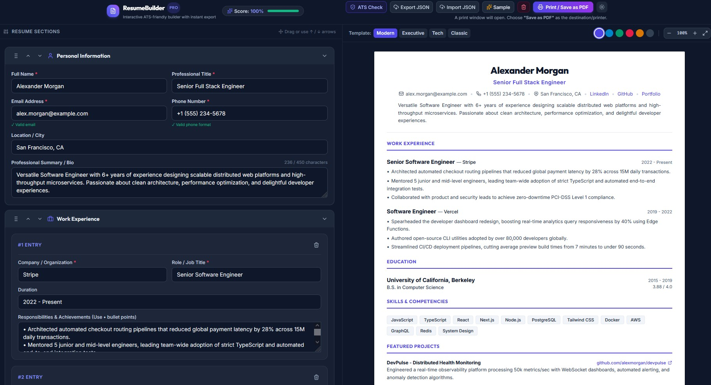
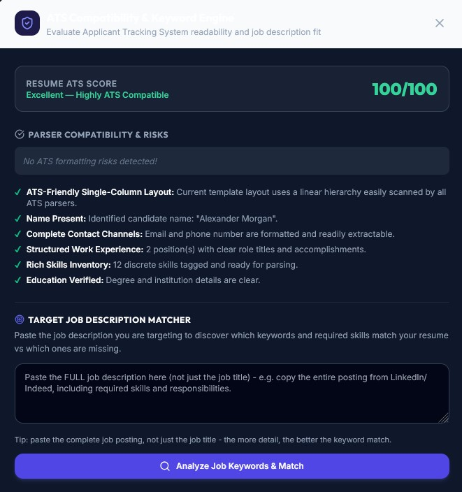
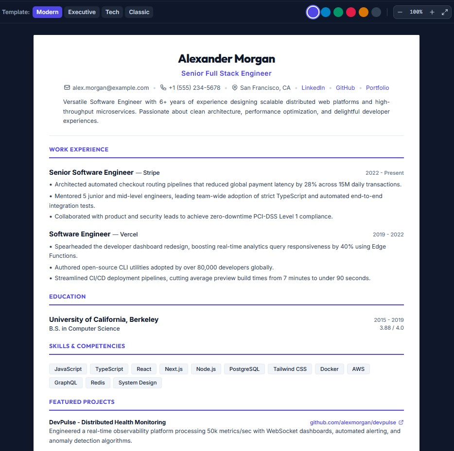
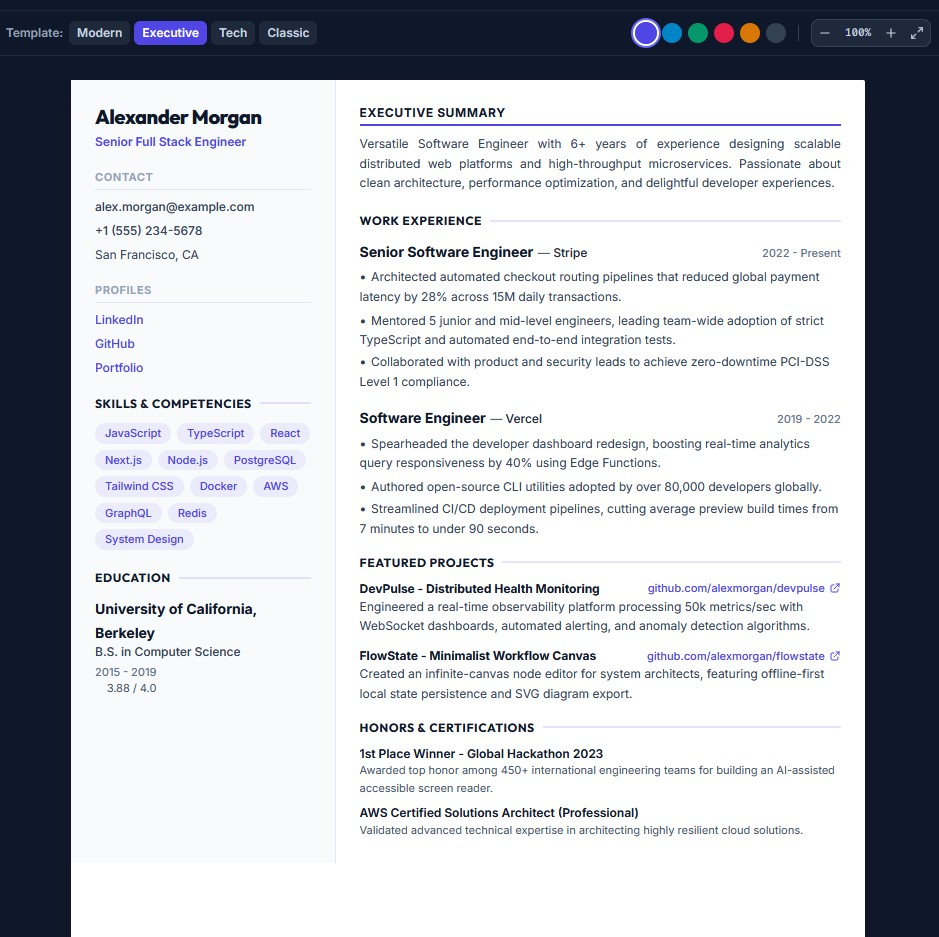
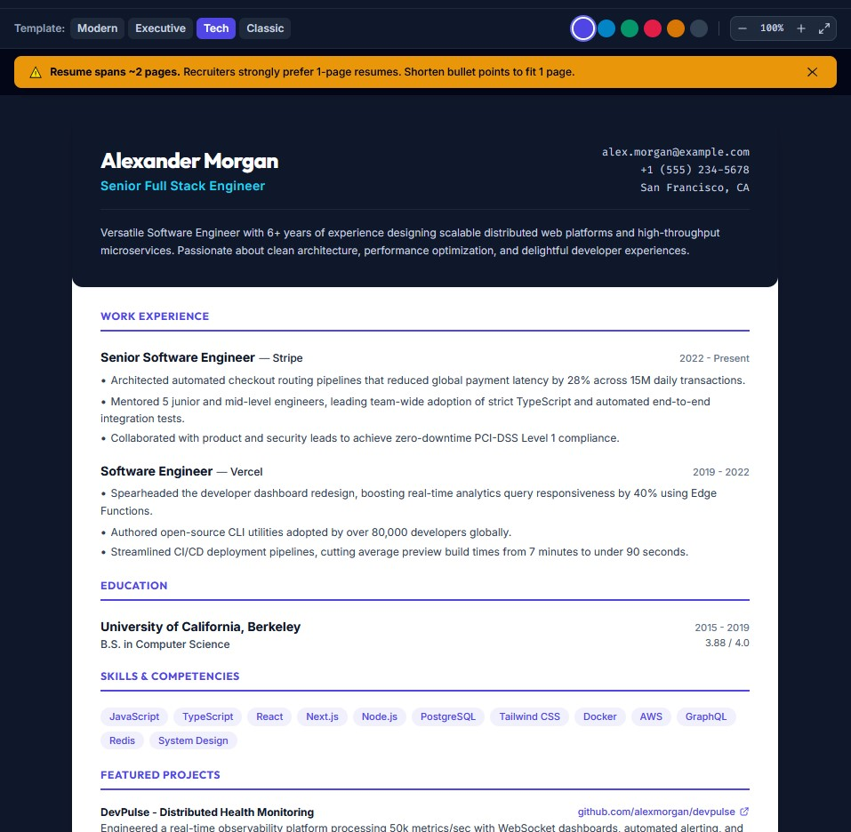
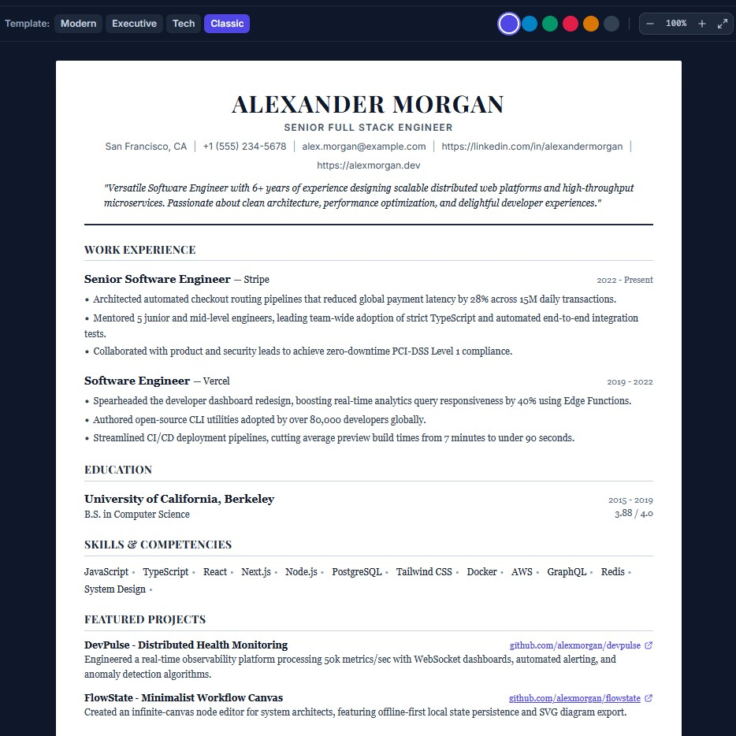
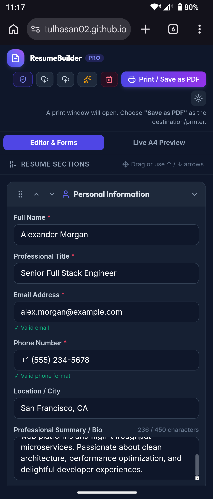

# ResumeBuilder Pro 🚀

A modern, interactive resume builder designed to help users create professional, ATS-aware resumes, analyze job-description keywords, customize resume designs, and print or save their resumes as PDF directly from the browser.

## 🔗 Live Demo

**Live Website:** https://ratulhasan02.github.io/ResumeX-Smart-Resume-Builder/

**GitHub Repository:** https://github.com/Ratulhasan02/ResumeX-Smart-Resume-Builder

---

## 🎯 Problem

Creating a professional and ATS-friendly resume can be difficult, especially when users need to manage formatting, templates, job-specific keywords, and resume length separately.

ResumeBuilder Pro brings these features together in one simple, browser-based application.

---

## 💡 Solution

ResumeBuilder Pro allows users to:

- Build and edit resumes with a live preview
- Check ATS compatibility
- Match resume keywords with a job description
- Detect potentially problematic two-column layouts
- Choose from multiple professional templates
- Reorder resume sections
- Export and import resume data as JSON
- Manage multiple independent resume profiles
- Print or save resumes as PDF
- Monitor resume completeness
- Detect one-page visual overflow

The application is completely client-side and does not require a backend or database.

---

## ✨ Key Features

### 🛡️ 1. ATS Compatibility Checker & Job Matcher

- **ATS Compatibility Score (0–100)** based on resume structure, contact information, essential sections, formatting, and other ATS-related factors.
- **2-Column Layout Detection** with a warning when a two-column template may cause reading-order issues in some ATS systems.
- **ATS-Friendly Formatting Check** for contact details, work history, skills, education, and template layout.
- **Job Description Keyword Matcher** to analyze a target job description.
- **Keyword Match Percentage** showing how closely the resume matches the provided job description.
- **Matched vs Missing Keywords** to help identify important missing skills.
- **Dynamic ATS Results** that update while the checker is open as resume content, template, or job description changes.
- **Weighted keyword scoring** extracts ranked one- to three-word phrases, resolves aliases across technology, marketing, finance, healthcare, and design, and gives required terms extra weight.
- **Bullet and format diagnostics** flag weak openings, missing metrics, long or repetitive bullets, emojis, inconsistent dates, long summaries, and missing profile links with shortcuts to relevant fields.
- **Per-profile score history** retains the last five ATS and job-match scores.

---

### 📄 2. Print / Save as PDF & 1-Page Overflow Protection

- **Print / Save as PDF** using the browser's native print functionality.
- Selectable text and links in the printed PDF.
- Print-specific `@media print` styling.
- **1-Page Visual Overflow Warning** that detects when resume content extends beyond a standard A4 page height.
- Helps users keep their resume concise and visually controlled.

---

### 🎨 3. Professional Templates & Accent Colors

ResumeBuilder Pro includes four different resume templates:

- **Modern Clean** — Single-column layout with clean dividers and balanced spacing.
- **Executive Split** — Asymmetric two-column design with a contact and skills sidebar.
- **Tech Specialist** — Developer-focused design with technology badges and GitHub links.
- **Classic Elegance** — Traditional serif typography and formal structure.

### 👤 4. Multiple Resume Profiles

- **Profile Switcher** — Switch between several independent resumes from the header without leaving the editor.
- **New Profiles** — Start a blank profile or duplicate the current profile as a tailored variant.
- **Profile Management** — Rename profiles, delete profiles with confirmation, and keep at least one profile available at all times.
- **Profile-Specific Settings** — Each profile preserves its own resume content, template, accent color, section order, and saved job description. Dark/light theme is global.
- **Sample Profile** — Loading sample data switches to and resets the existing `Sample Profile`, or creates it once if needed.
- **Import JSON** — Choose whether to import a backup as a new profile or overwrite the active profile.
- Profiles are stored locally in the browser and require no backend, account, or manual JSON file juggling.

---
### 🎨 Dynamic Accent Colors

Users can select from six accent colors:

- Indigo
- Sky Blue
- Emerald
- Rose
- Amber
- Slate

The selected color is applied dynamically across the resume templates.

---

### 🔄 5. Drag & Drop & Keyboard Section Reordering

- Mouse and touch-based drag-and-drop reordering powered by **SortableJS**.
- Keyboard-accessible **Up / Down** controls.
- `aria-label` attributes for improved accessibility.
- Section order is synchronized with the central `resumeData` state.
- Live preview updates after reordering.

---

### 💾 6. JSON Backup

- **Export JSON** — Download a complete resume profile as a `.json` file.
- **Import JSON** — Restore previously saved resume data into a new profile or the active profile.

---

### ⚡ 7. Performance & Input Validation

- **Debounced Live Preview** for smoother editing.
- **Live Summary Character Counter** with a 450-character limit.
- Real-time email format validation.
- Phone number validation.
- Dynamic validation feedback while entering information.

---

### 📱 8. Responsive Design & User Experience

- Responsive editor and resume preview layout.
- **Mobile Tab Switcher** for switching between the editor and live A4 preview on smaller screens.
- Helpful empty state for new users.
- Sample resume data for quick testing.
- Dark and Light mode.
- Theme preference stored using `localStorage`.

---

## 📸 Screenshots

### Resume Editor



### ATS Compatibility Checker



### Resume Templates

#### Template 1



#### Template 2



#### Template 3



#### Template 4



### Mobile Interface



---

## 🛠️ Tech Stack

- HTML5
- CSS3
- Vanilla JavaScript
- ES6 Modules
- LocalStorage
- SortableJS
- Native Browser Print
- Lucide Icons
- Tailwind CSS CLI

Run `npm install` once, then `npm run build:css` to compile utility classes into `css/tailwind.css`.

---

## 📁 Folder Structure

```text
ResumeX-Smart-Resume-Builder/
│
├── index.html
├── .gitignore
├── README.md
│
├── assets/
│   └── favicon.svg
│
├── css/
│   ├── style.css
│   ├── tailwind.input.css
│   └── tailwind.css
│
├── data/
│   └── skills.json
│
├── js/
│   ├── atsChecker.js
│   ├── atsEngine.js
│   ├── completeness.js
│   ├── dragDrop.js
│   ├── formHandlers.js
│   ├── main.js
│   ├── pdfExport.js
│   ├── renderPreview.js
│   ├── state.js
│   ├── templates.js
│   ├── theme.js
│   ├── utils.js
│   └── validators.js
├── package.json
├── tailwind.config.cjs
│
├── screenshots/
│   ├── ats-checker.jpg
│   ├── editor.jpg
│   ├── mobile.png
│   ├── template1.jpg
│   ├── template2.jpg
│   ├── template3.jpg
│   └── template4.jpg
│
└── tests/
```
## 📊Data Model

The application uses a central `resumeData` object to manage resume information and application state.

```javascript
const resumeData = {
  personal: {
    name: "",
    title: "",
    email: "",
    phone: "",
    location: "",
    summary: ""
  },

  education: [
    { school: "", degree: "", year: "", grade: "" }
  ],

  experience: [
    { company: "", role: "", duration: "", description: "" }
  ],

  skills: [
    "JavaScript",
    "React"
  ],

  projects: [
    { title: "", description: "", link: "" }
  ],

  achievements: [
    { title: "", description: "" }
  ],

  links: {
    linkedin: "",
    github: "",
    portfolio: ""
  },

  meta: {
    template: "template1",
    accentColor: "#4f46e5",
    jobDescription: "",
    sectionOrder: [
      "personal",
      "experience",
      "education",
      "skills",
      "projects",
      "achievements",
      "links"
    ]
  }
};
```

### Multiple Profile Storage

ResumeBuilder Pro stores a lightweight profile registry separately from the active profile's resume data:

```text
resume_builder_profiles_index = {
  activeProfileId: "profile_abc123",
  profiles: [
    { id: "profile_abc123", name: "Frontend Resume", createdAt: "...", updatedAt: "..." }
  ]
}

resume_builder_data_profile_abc123 = { personal, education, experience, ... }
```

Only the active profile's resume data is loaded into memory. Existing users are migrated automatically: if the legacy `resume_builder_data_v1` key is found and no profile registry exists, it becomes a first profile named `My Resume` without losing work. The active profile ID and each profile's data persist across page refreshes.

## 🚀 How to Run Locally

Because the application uses native ES6 JavaScript modules, it should be run through a local web server.

### Option 1: Python

```bash

python -m http.server 4173
```

Then open:

```text

http://localhost:4173
```

### Option 2: Node.js

```bash
npx serve .
```

---

## 🌐 Deployment

The project is currently deployed using GitHub Pages.

The application is fully client-side and does not require a backend server or database.

---

## 🔮 Future Improvements

Possible future improvements include:

* More resume templates
* More advanced ATS analysis
* Improved job-specific recommendations
* Additional export formats
* Cloud-based resume storage
* User authentication
* AI-powered resume suggestions
* More detailed accessibility improvements

---

## 🎓 Project Purpose

This project was developed as a frontend-focused project to demonstrate practical skills in:

* HTML
* CSS
* JavaScript
* Responsive Web Design
* UI/UX
* Client-side data management
* Browser-based PDF printing
* Accessibility
* Git & GitHub

---

## 👨‍💻 Author

**Ratul Hasan**

BSc in Computer Science & Engineering

---

## 📄 License

This project is created for educational and portfolio purposes.
